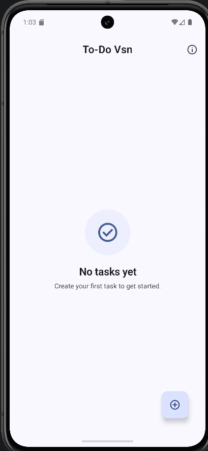
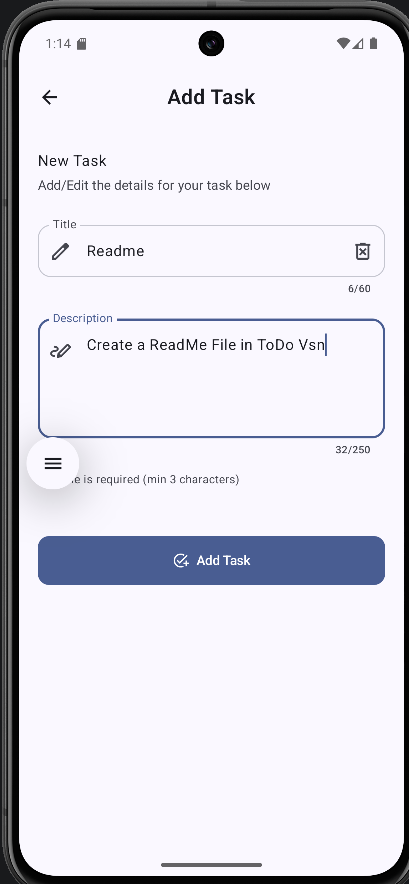
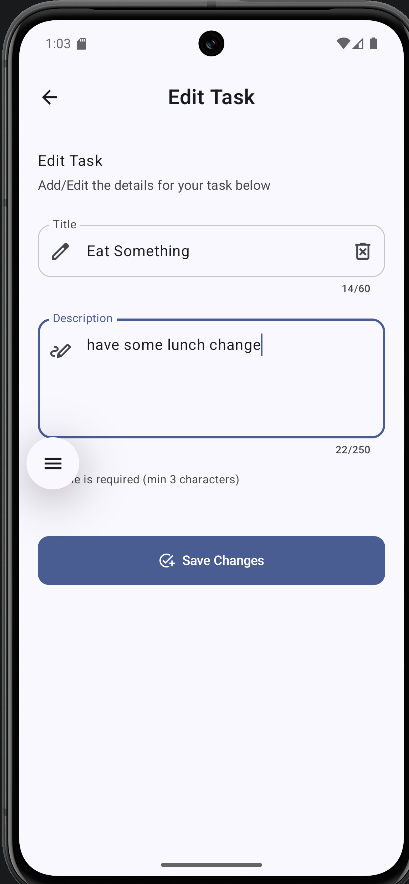
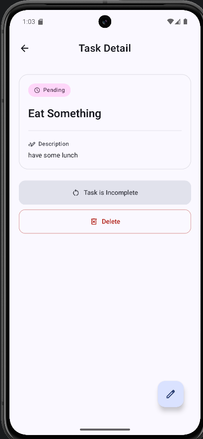
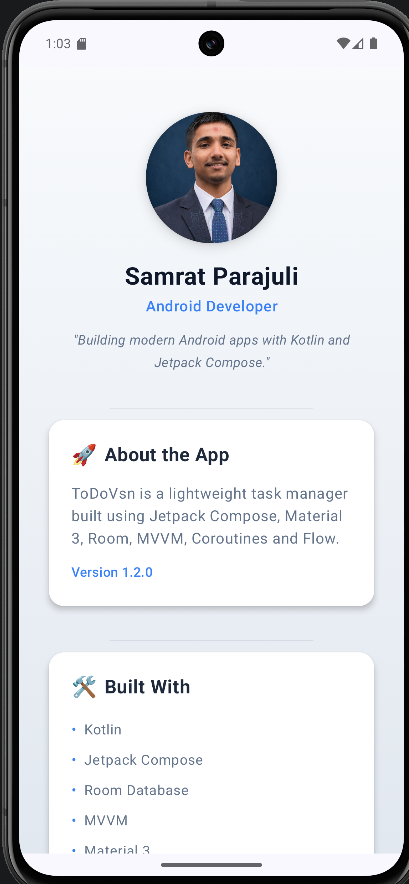
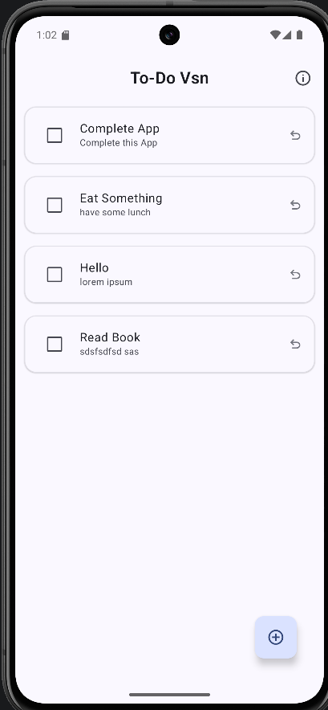

# To-Do Vsn 🚀

To-Do Vsn is a lightweight, modern task management application built with Jetpack Compose and Material 3. It provides a seamless experience for organizing daily tasks with a focus on simplicity, performance, and a polished user interface.

---

## Screenshots

| Home | Add Task | Edit Task | Details | About | Tasks Screen |
|------|----------|-----------|---------|-------|
|  |  |  |  |  |   |

---

## Features ✨

* **Manage Tasks**: Effortlessly add, edit, and delete tasks.
* **Mark Completion**: Toggle task status between pending and completed.
* **Swipe to Delete**: Quick and intuitive swipe-to-dismiss gesture on the home screen.
* **Task Details**: View detailed information about each task, including descriptions and status.
* **Persistent Storage**: Uses Room Database to ensure your tasks are saved locally.
* **Material 3 UI**: Modern, clean design following the latest Material Design 3 guidelines.
* **Info/About Screen**: Dedicated section with developer information and tech stack details.
* **Empty State Handling**: Elegant placeholders when no tasks are present.
* **Responsive Navigation**: Type-safe navigation patterns between screens.
* **Adaptive Launcher Icon**: Professional icon support for various Android device themes.

---

## Tech Stack 🛠

* **Kotlin**: Primary programming language.
* **Jetpack Compose**: Modern declarative UI toolkit.
* **Material 3**: Latest design system for Android.
* **Navigation Compose**: Routing and navigation management.
* **Room Database**: Local data persistence layer.
* **ViewModel**: UI state management following lifecycle awareness.
* **StateFlow & mutableStateOf**: Reactive state handling for UI updates.
* **Coroutines**: Asynchronous programming for database operations.
* **KSP (Kotlin Symbol Processing)**: Faster annotation processing for Room.
* **AndroidX Libraries**: Core components for modern Android development.

---

## Architecture 🏛️

The project follows the **MVVM (Model-View-ViewModel)** architectural pattern and the **Repository Pattern** to ensure a clean separation of concerns:

* **Presentation Layer**: Jetpack Compose screens and ViewModels.
* **Domain Layer**: Repository interfaces for data abstraction.
* **Data Layer**: Room database implementation, DAOs, and entities.
* **Single Activity Architecture**: Entire navigation handled within a single `MainActivity`.

---

## Project Structure 📂

```text
app/
 ├── data/                # Data entities, DAOs, Database, and Repository
 ├── ui/
 │   ├── home/            # Home screen and HomeViewModel
 │   ├── screens/         # Add, Edit, Details, and Info screens/ViewModels
 │   ├── navigation/      # Navigation graph and destination definitions
 │   └── theme/           # Color schemes, Typography, and Shapes (Material 3)
 ├── ToDoApp.kt           # Top-level App Composables
 └── MainActivity.kt      # Entry point of the application
```

---

## Installation ⚙️

1. **Clone the repository**:
   ```bash
   git clone https://github.com/SamratVsn/Todovsn.git
   ```
2. **Open in Android Studio**:
   Launch Android Studio and select `Open` -> Navigate to the cloned directory.
3. **Sync Gradle**:
   Wait for the IDE to finish syncing the project dependencies.
4. **Run the app**:
   Connect an Android device or start an emulator and click the `Run` icon.

---

## Requirements 📋

* **Minimum SDK**: 24 (Android 7.0)
* **Target SDK**: 37 (Android 15)
* **Compile SDK**: 37
* **Kotlin Version**: 2.2.10
* **Gradle Version**: 9.3.1 (AGP)

---

## Libraries Used 📚

| Library | Purpose |
| ------- | ------- |
| `androidx.compose.ui` | UI framework components |
| `androidx.compose.material3` | Material Design 3 components |
| `androidx.navigation:navigation-compose` | In-app navigation |
| `androidx.room3` | SQLite object mapping for persistence |
| `androidx.lifecycle:lifecycle-viewmodel-compose` | ViewModel integration with Compose |
| `androidx.activity:activity-compose` | Entry point for Compose in Activity |
| `kotlinx.coroutines` | Asynchronous task handling |

---

## Future Improvements 🚀

* **Search Functionality**: Quickly find tasks by title or content.
* **Task Categories**: Group tasks into Work, Personal, or custom labels.
* **Notifications**: Set reminders and due dates for important tasks.
* **Cloud Sync**: Integrate Firebase or a backend for multi-device sync.
* **Priority Levels**: Visually distinguish high-priority tasks.
* **Dark/Light Mode Toggle**: Manual override for system theme.

---

## License 📄

This project is licensed under the MIT License - see the [LICENSE](LICENSE) file for details.

---

## Author 👤

**Samrat Parajuli**

* **Portfolio**: [samratparajuli0.com.np](https://www.samratparajuli0.com.np/)
* **GitHub**: [@SamratVsn](https://github.com/SamratVsn)
* **LinkedIn**: [Samrat Parajuli](https://linkedin.com/in/samratvsn)
