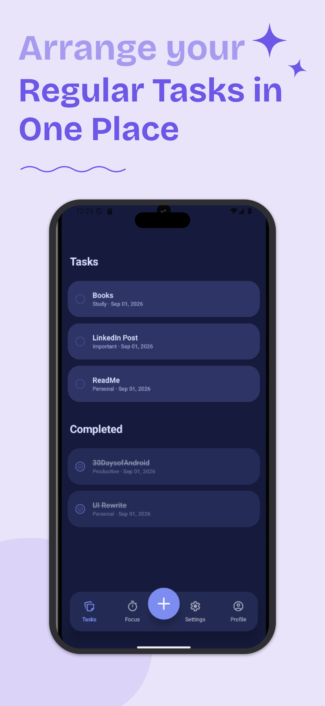
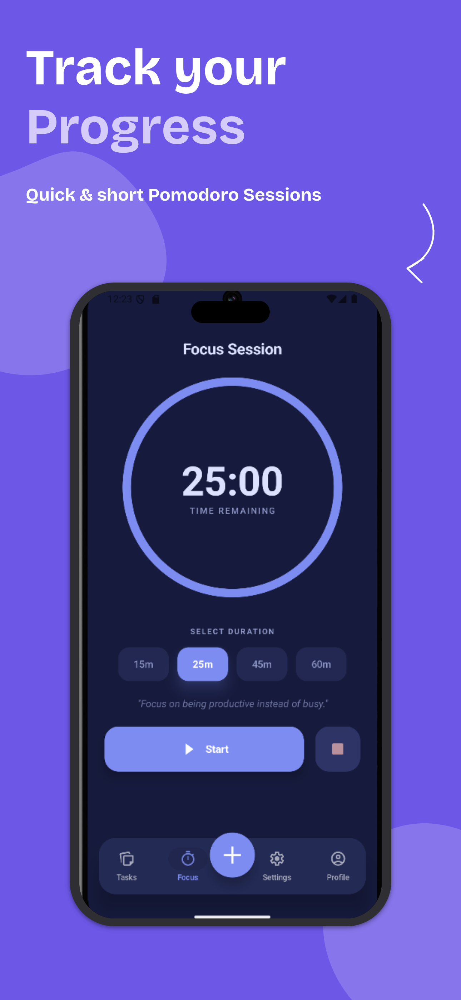
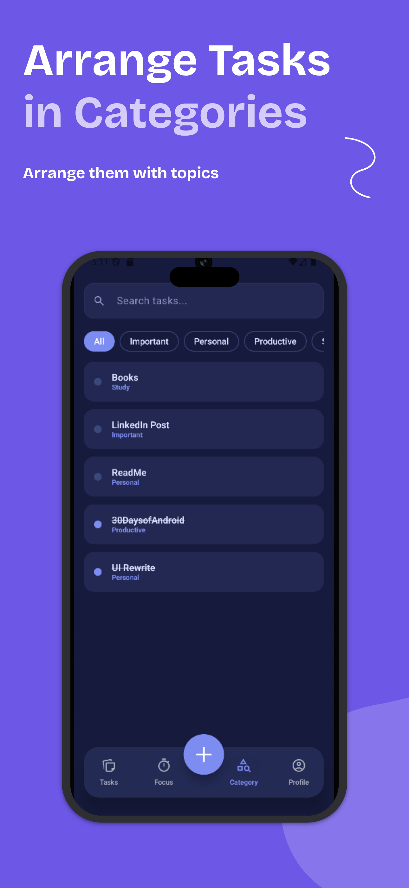
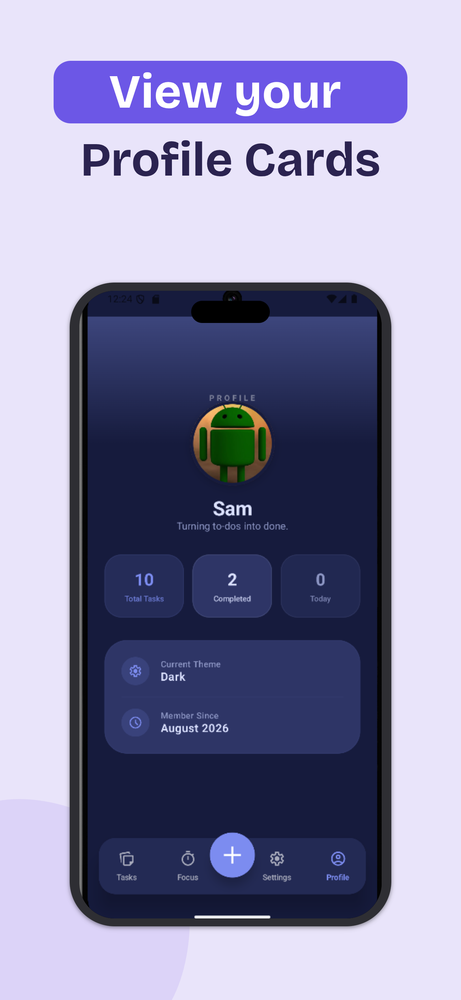
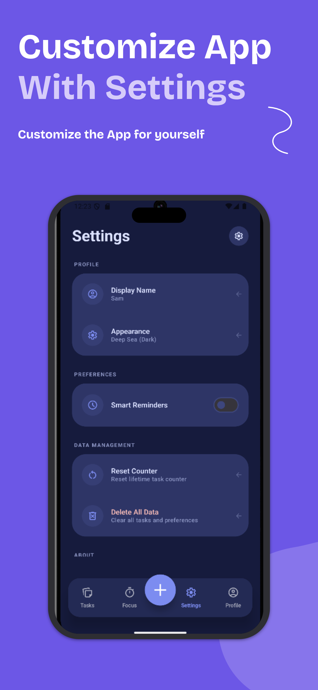
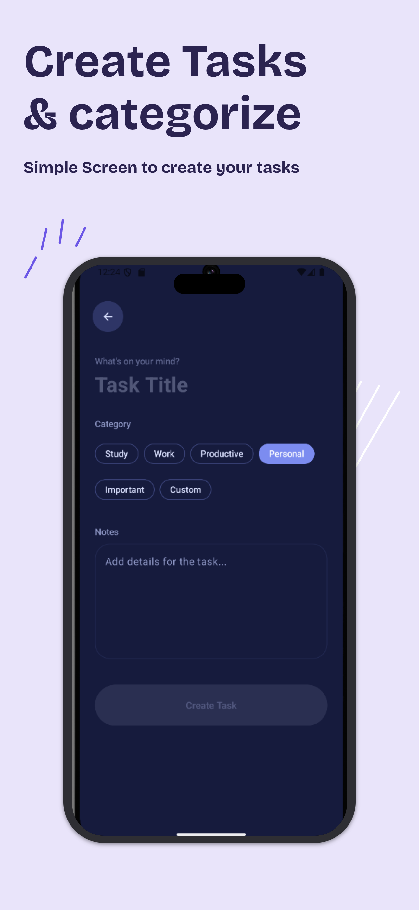
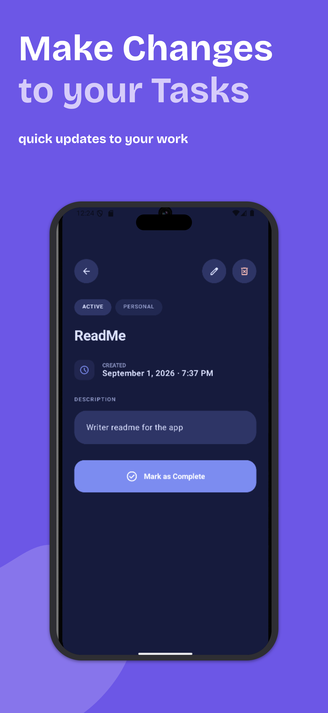

# Tasks 🚀


-3DDC84?logo=android&logoColor=white)


Tasks is a sleek, modern, and productivity-focused task management app built with **Jetpack Compose** and **Material 3**. Create tasks, organize them by category, stay on track with search and filtering, build focus with a Pomodoro-style timer, and watch your progress on a personalized profile — all stored locally on your device.

---

## Table of Contents

*   [Screenshots](#screenshots)
*   [Key Features](#key-features-)
*   [Tech Stack](#tech-stack-)
*   [Architecture](#architecture-️)
*   [Project Structure](#project-structure-)
*   [Getting Started](#getting-started-)
*   [Testing](#testing-)
*   [Requirements](#requirements-)
*   [Future Roadmap](#future-roadmap-)
*   [Contributing](#contributing-)
*   [Author](#author-)
*   [License](#license-)

---

## Screenshots

| Home | Focus | Categories | Profile |
|------|-------|------------|---------|
|  |  |  |  |

| Settings | Add Task | Task Details |
|----------|----------|--------------|
|  |  |  |

---

## Key Features ✨

*   **Task Management**: Create, edit, delete, and complete tasks with a clean UI. Deleting a task offers an **Undo** action to restore it.
*   **Validation**: Task titles must be at least 3 non-blank characters, enforced both in the UI (disabled save button) and the ViewModel.
*   **Search & Filter**: Find tasks instantly with case-insensitive search across titles and descriptions, combined with category-based filtering.
*   **Focus Sessions**: Integrated Pomodoro-style timer with preset durations (15m, 25m, 45m, 60m) plus a custom duration picker (1–120 min). Completed sessions are counted per day with a celebration dialog.
*   **Personalized Profile**: Real-time statistics — all-time tasks created, completed count, today's tasks, and today's focus sessions — alongside a customizable display name and motivational bios.
*   **Dynamic Theming**: System Default, Light Mode, and a custom "Deep Sea" Dark Mode, persisted across restarts.
*   **Custom Navigation**: Floating bottom navigation bar with an elevated center FAB for quick task entry, preserving each tab's state.
*   **Smart Reminders**: A persisted reminders preference toggle in Settings (notification scheduling is on the roadmap).
*   **Category Management**: Ships with defaults (Study, Work, Productive, Personal, Important). Add trimmed custom categories; deleting one safely moves its tasks back to `Personal`.
*   **Data Management**: Reset your all-time counter or wipe all tasks and preferences, each behind a confirmation dialog.
*   **Persistent Storage**: Room database for tasks and categories, DataStore Preferences for theme, name, counters, and settings — including daily rollover of the focus-session count.
*   **Polished UI/UX**: Splash screen, gradient backgrounds, custom animations, and refined Material 3 components.

---

## Tech Stack 🛠

| Layer | Technology |
|-------|------------|
| Language | **Kotlin** 2.2.10 |
| UI | **Jetpack Compose** (BOM 2026.02.01) + **Material 3** |
| Navigation | **Navigation Compose** 2.9.8 (single-activity, string routes) |
| Local DB | **Room** 3.0.0-alpha05 (entities, DAOs, `MIGRATION_6_7` seed) |
| Preferences | **DataStore Preferences** 1.2.1 |
| Async | **Coroutines & Flow** (`StateFlow`, `combine`, `stateIn`) |
| State | **ViewModel** + lifecycle-aware `collectAsStateWithLifecycle` |
| DI | Manual **`AppContainer`** (`AppDataContainer`) wired via `AppViewModelProvider.Factory` |
| Launch | **SplashScreen API** + edge-to-edge |
| Desugaring | `desugar_jdk_libs` 2.1.4 (`java.time` support back to min SDK) |
| Testing | **JUnit 4** + **kotlinx-coroutines-test** (fake-repository ViewModel tests) |

---

## Architecture 🏛️

The project follows **MVVM** with the **Repository Pattern** and unidirectional data flow:

*   **Presentation**: Compose screens (Home, Focus, Category, Profile, Settings, Add/Edit, Details) observe `StateFlow` UI state from their ViewModels; events flow up via ViewModel functions.
*   **Domain**: `ToDoRepository` / `PreferenceRepository` abstract data access. Pure, framework-free rules (title validation, task filtering, focus rollover, name normalization) live in top-level functions so they are unit-testable.
*   **Data**: Room (`ToDoDao`, `CategoryDao`, `ToDoDatabase` with `DateConverters`) and a Preferences DataStore (`UserPreferences`, `ThemeMode`).
*   **Navigation**: Centralized `ToDoNavHost` manages the app flow within a single `MainActivity`; `ToDoApp` provides the scaffold, floating nav bar, and center FAB.

---

## Project Structure 📂

```text
app/
├── src/main/java/com/example/todovsn/
│   ├── data/
│   │   ├── ToDoItem.kt / Category.kt      # Room entities
│   │   ├── ToDoDao.kt / CategoryDao.kt    # DAOs
│   │   ├── ToDoDatabase.kt                # DB, MIGRATION_6_7, DateConverters
│   │   ├── ToDoRepository.kt / OfflineToDoRepository.kt
│   │   ├── AppContainer.kt                # Manual DI
│   │   └── preference/                    # UserPreferences, PreferenceRepository
│   ├── ui/
│   │   ├── home/                          # Home screen + HomeViewModel
│   │   ├── screens/                       # Add/Edit/Details/Focus/Category/
│   │   │                                  # Profile/Settings + ViewModels
│   │   ├── components/                    # Shared dialogs & UI pieces
│   │   ├── navigation/                    # Destinations + ToDoNavGraph
│   │   ├── theme/                         # Deep Sea colors, Typography
│   │   └── AppViewModelProvider.kt        # ViewModel factory
│   ├── ToDoApp.kt                         # Scaffold + floating nav + FAB
│   ├── MainActivity.kt                    # Entry point, theme, splash
│   └── ToDoApplication.kt                 # App container init
└── src/test/java/com/example/todovsn/      # Local unit tests (see Testing)
```

---

## Getting Started ⚙️

### Prerequisites

*   **Android Studio** (Ladybug or newer — bundles the JDK required by AGP 9.x)
*   An emulator or device running **Android 8.0 (API 26)+**

### Steps

1.  **Clone the repo**:
    ```bash
    git clone https://github.com/SamratVsn/Todovsn.git
    ```
2.  **Open in Android Studio**:
    Select `Open` and navigate to the project folder.
3.  **Sync & Build**:
    Wait for Gradle to sync dependencies (`./gradlew assembleDebug` from the terminal works too).
4.  **Run**:
    Click `Run` to deploy to your device or emulator.

---

## Testing 🧪

Local unit tests live in `app/src/test/` — **38 tests across 7 classes**, runnable on the JVM with no device needed:

```bash
./gradlew :app:testDebugUnitTest
```

| Test class | What it covers |
|------------|----------------|
| `ToDoValidationTest` | Title rule: blank/short invalid, 3+ chars valid, trim handling |
| `ToDoMappingTest` | `ToDoDetails` ↔ `ToDoItem` field preservation + round-trip |
| `FocusUiStateTest` | `MM:SS` formatting, progress fractions, zero-total guard |
| `CategoryFilterTest` | Search (title/desc, case-insensitive) × category filtering |
| `PreferencesLogicTest` | Daily focus-session rollover, display-name normalization |
| `DateConvertersTest` | Room converter round-trips, null-safety, corrupt-data tolerance |
| `HomeViewModelTest` | Delete, undo-restore, toggle-complete via fake repository |

---

## Requirements 📋

*   **Min SDK**: 26 (Android 8.0)
*   **Target / Compile SDK**: 37 (Android 15)
*   **App version**: 1.0 (`versionCode 1`)
*   **Kotlin**: 2.2.10
*   **AGP**: 9.4.0 · **Gradle wrapper**: 9.6.0

---

## Future Roadmap 🚀

*   **Reminder notifications**: scheduling behind the existing Smart Reminders toggle.
*   **Cloud Sync**: Firebase integration for multi-device synchronization.
*   **Custom Tags**: Personal labels for better task organization.
*   **Atomic category moves**: transactional `deleteCategoryAndMoveTasks` + foreign-key integrity.
*   **Interactive Widgets**: Access your tasks directly from the home screen.
*   **Detailed Analytics**: Visual charts for weekly and monthly productivity trends.

---

## Contributing 🤝

Contributions are welcome! Please:

1.  Fork the repo and create a feature branch (`git checkout -b feature/my-change`).
2.  Add or update unit tests under `app/src/test/` for logic changes.
3.  Make sure `./gradlew :app:testDebugUnitTest` passes.
4.  Open a pull request with a clear description.

---

## Author 👤

**Samrat Parajuli**

*   **GitHub**: [@SamratVsn](https://github.com/SamratVsn)
*   **Portfolio**: [samratparajuli0.com.np](https://www.samratparajuli0.com.np/)
*   **LinkedIn**: [Samrat Parajuli](https://linkedin.com/in/samratvsn)

---

## License 📄

This project is licensed under the MIT License — see the [LICENSE](LICENSE) file for details.
